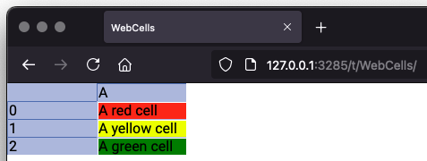

# Cells

At the core of Sigbla and `Table` we find the `Cell`. The cell is what holds the value we're putting into the table.
And as with `Column` and `Row`, a cell is tied to a particular table, and also a particular column and index.

## Creating cells

As with `Column` and `Row`, cells are not something you create directly, but instead something you obtain from a table.
If you start with an empty table, you can obtain a cell from any possible column and row combination. Cells hence always
exist in some form, even when they are empty.

Let's start by looking at an empty cell in more detail:

``` kotlin
val table = Table["MyTable"]

val cellA1 = table["A", 1]

println("Table: ${cellA1.table}")
println("Column: ${cellA1.column}")
println("Index: ${cellA1.index}")
println("Value: ${cellA1.value}")
println("Numeric: ${cellA1.isNumeric}")
println("Text: ${cellA1.isText}")

// Output:
// Table: Table[MyTable]
// Column: [A]
// Index: 1
// Value: kotlin.Unit
// Numeric: false
// Text: false
```

There are other properties and functions on a cell beyond these, but this is a good starting point.

As we can tell, it's linked to our table, column and index. We can also tell that it contains a `value`, in this case
a `Unit`, which is the case for all empty cells, which are neither numeric nor text.

The fact that `value` is Unit also dictates the specific type of the cell. Let's look at the type of this cell:

``` kotlin
val table = Table["MyTable"]

val cellA1 = table["A", 1]

println("Type: ${cellA1::class}")

// Output:
// Type: class sigbla.app.UnitCell
```

So, a `UnitCell` holds a `Unit`. You might be able to guess some other types of supported cells, but let's look at them
all next:

``` kotlin
import sigbla.app.*
import kotlinx.html.p
import java.math.BigDecimal
import java.math.BigInteger

fun main() {
    val table = Table[null]

    table["Types", 1] = "Some text"
    table["Types", 2] = true
    table["Types", 3] = Long.MAX_VALUE
    table["Types", 4] = Double.MAX_VALUE
    table["Types", 5] = BigInteger.ZERO
    table["Types", 6] = BigDecimal.TEN
    table["Types", 7] = div { p { +"HTML content" } }

    print(table)

    // Output:
    //                                |Types                          
    // 1                              |Some text                      
    // 2                              |true                           
    // 3                              |9223372036854775807            
    // 4                              |1.7976931348623157E308         
    // 5                              |0                              
    // 6                              |10                             
    // 7                              |<div><p>HTML content</p></div> 
}
```

| Value type | Cell type      | Is numeric | Is text |
|------------|----------------|------------|---------|
| Unit       | UnitCell       | false      | false   |
| Boolean    | BooleanCell    | false      | false   |
| String     | StringCell     | false      | true    |
| Long       | LongCell       | true       | false   |
| Double     | DoubleCell     | true       | false   |
| BigInteger | BigIntegerCell | true       | false   |
| BigDecimal | BigDecimalCell | true       | false   |
| WebContent | WebCell        | false      | false   |

Most of these should be fairly self-explanatory, and we'll cover `WebContent` and `WebCell` in more detail later.
Support for more types is on the roadmap, but the above is what's supported in the latest release.

You can clear a cell by assigning a null to it, returning it to a `UnitCell`, for example `table["A", 1] = null`, or
you may use the `clear(cell)` function if you prefer.

## Iterating over cells

We said earlier that cells always exist in some form. You can obtain a cell from any valid combination of a column and
a row. However, if you were to iterate over the cells in a table, column, row, or other such table references,
`UnitCell` is never included.

``` kotlin
val table = Table[null]
val column = table["A"]
val row = table[1]
val cell = table["A", 1]

// Iterators can be obtained on all of these,
// but will not return any cells if empty
table.iterator()
column.iterator()
row.iterator()

// You can even do an iterator on a cell itself,
// which will just return itself if it's not a UnitCell
cell.iterator()
```

Note that `UnitCell` does however show up in event subscriptions, something covered in the chapter on table subscriptions.

Often you wouldn't bother calling the `iterator()` function, and instead just use other sequence related functions
such as `filter`, `map`, and `forEach` directly. But it is worth knowing that iterators return stable snapshots of the
values as they existed at the point when the iterator was created. This is not quite the same as cloning a table,
because the cells returned are still tied to the original table. We'll cover this topic in more detail in the chapter
on concurrency.

``` kotlin
val table = Table[null]

table["A", 1] = "A1v1"

val iterator = table.iterator()

// Even if we change the table now, the iterator returns
// cells as they existed when creating the iterator
table["A", 1] = "A1v2"

iterator.forEach {
    println(it)
}

// Output:
// A1v1

print(table)

// Output:
//      |A    
// 1    |A1v2 
```

## Equality and value comparisons

Cells, when using `==` to compare them, are equal to other cells if they belong to the same table, column, index and
hold the same value. But you can also compare cells against their value by using the `in` operator.

When using the `in` operator, cells are compared based on the value they contain. It doesn't matter if they belong to
different tables, columns or rows. If the value in one cell rank equal to a value in another cell, these cells are
considered equal when using the `in` operator.

``` kotlin
val t1 = Table[null]
val t2 = Table[null]

fun assert(value: Boolean) {
    if (!value) { throw AssertionError() }
}

t1["A", 1] = BigInteger.TEN
t2["B", 2] = BigInteger.TEN

assert(t1["A", 1] != t2["B", 2])
assert(t1["A", 1] in t2["B", 2])
assert(BigInteger.TEN in t2["B", 2])

assert(t1["A", 1].table != t2["B", 2].table)
assert(t1["A", 1].index != t2["B", 2].index)
assert(t1["A", 1].column.header != t2["B", 2].column.header)
```

You see above we can also compare one cell's value against another cell with `in` when doing `t1["A", 1] in t2["B", 2]`.

To fully understand the `in` equality of cells, we first need to understand how one cell ranks against another, so let's
start with an example:

``` kotlin
val table = Table[null]

table["Types", 1] = "Some text"
table["Types", 2] = true
table["Types", 3] = Long.MAX_VALUE
table["Types", 4] = Double.MAX_VALUE
table["Types", 5] = BigInteger.ZERO
table["Types", 6] = BigDecimal.TEN
table["Types", 7] = div { +"HTML content" }

val unitCell = table["Types", 0]
val stringCell = table["Types", 1]
val booleanCell = table["Types", 2]
val longCell = table["Types", 3]
val doubleCell = table["Types", 4]
val bigIntegerCell = table["Types", 5]
val bigDecimalCell = table["Types", 6]
val webCell = table["Types", 7]

listOf(
    unitCell, stringCell, booleanCell, longCell,
    doubleCell, bigIntegerCell, bigDecimalCell,
    webCell
).sorted().forEach {
    println("$it [${it::class}]")
}

// Output:
//  [class sigbla.app.UnitCell]
// 0 [class sigbla.app.BigIntegerCell]
// 10 [class sigbla.app.BigDecimalCell]
// 9223372036854775807 [class sigbla.app.LongCell]
// 1.7976931348623157E308 [class sigbla.app.DoubleCell]
// <div>HTML content</div> [class sigbla.app.WebCell]
// Some text [class sigbla.app.StringCell]
// true [class sigbla.app.BooleanCell]
```

It's not immediately obvious what's going on, other than obtaining a list of cells that have been sorted according to
some rules, so let's lay out the rules:

**Rule 1:** A unit cell is always the lowest ranking cell. Hence, it would come first when sorted.

**Rule 2:** If a cell isn't numeric (such as string and web cells) they rank the highest. Hence, they are last in our
sorted list.

**Rule 3:** A numeric cell, when compared against another numeric cell, is ranked according to the difference between the
two values they represent. Hence, our BigInteger cell with a value of zero is the first numeric cell in our sorted list,
followed by the BigDecimal cell with a value of 10, and so on, from low to high. Two cells with no difference are, like
when we did the `in` check in the earlier example, considered equal.

**Rule 4:** If we have multiple cells that aren't numeric (and not a unit cell), and because of rule 2 rank the highest,
they are sorted among themselves by doing a string comparison. Strings are compared like all other strings are in Kotlin,
and for cell types like `WebCell`, we obtain the string with a `toString` function call.

We can see from rule 3 that we don't have any type preference between numbers. It's simply down to the numeric difference.

Above we only compared cells to each other when sorting them. You can also compare cells to any other value,
which would follow the same ruleset, for example `table["Types", 5] <= 10` which is `true`.

If you wanted to compare the values using other rules, you can obtain the underlying value on the cell directly from
`cell.value`.

Because of these rules, we are able to give ourselves some flexibility when checking if a value is `in` a cell without
needing to know the exact numerical type. Say we want to check if a cell contains the numeric value of 10, without
needing to be concerned if this is a `Long`, `BigInteger`, or `BigDecimal`:

``` kotlin
val table = Table[null]

table["A", 1] = BigInteger.TEN

println("Long 10 in cell: ${10L in table["A", 1]}")
println("BigInteger 10 in cell: ${BigInteger.TEN in table["A", 1]}")
println("BigDecimal 10 in cell: ${BigDecimal.TEN in table["A", 1]}")

// Output:
// Long 10 in cell: true
// BigInteger 10 in cell: true
// BigDecimal 10 in cell: true

println("Long 10 == cell.value: ${10L == table["A", 1].value}")
println("BigInteger 10 == cell.value: ${BigInteger.TEN == table["A", 1].value}")
println("BigDecimal 10 == cell.value: ${BigDecimal.TEN == table["A", 1].value}")

// Output:
// Long 10 == cell.value: false
// BigInteger 10 == cell.value: true
// BigDecimal 10 == cell.value: false
```

## Checking if values are in a table, column or row

Much like we can use `in` on a cell to check if a value is held by the cell according to the above rules, we can also
use `in` like this on a table, column or row, so check if they hold cells that contain this value:

``` kotlin
val table = Table[null]

table["A", 0] = BigInteger.TEN
table["B", 1] = BigDecimal.ONE
table["C", 2] = "some string"

println("10 in table: ${10 in table}")
println("1 in row: ${1 in table[1]}")
println("string in column: ${"some string" in table["C"]}")

// Output:
// 10 in table: true
// 1 in row: true
// string in column: true
```

Under the hood, what this does is iterate over the contained cells, and checking if they contain the value with `in` on
those particular cells. One thing worth noting is that, because iterators don't include empty cells, we can't check if
a cell is empty that way. We can however check if a cell is empty with `in` if we do so directly against the empty cell:

``` kotlin
val table = Table[null]

val emptyCell = table["A", 0]

println(null in emptyCell)
println(Unit in emptyCell)
println(emptyCell is UnitCell)

// Output:
// true
// true
// true
```

You'll notice that both `Unit` and `null` can be used with `in` against the empty `UnitCell`.

## Immutability

Like the value they contain, all cell types are immutable. It's not possible to do `cell.value = "something"`.

You can however use a cell as a reference within a table, allowing you to do `table[cell] = "new value"`, and because
the cell contains a reference to its table, you can do `cell.table[cell] = "new value"` as well.

There is a shorthand convenience function for this: `cell("new value")`. This however doesn't change the original
cell, as shown in this example:

``` kotlin
val table = Table[null]

table["A", 1] = "First value"

val cellA1v1 = table["A", 1]

cellA1v1("Second value")

val cellA1v2 = table["A", 1]

println(cellA1v1)
println(cellA1v2)

// Output:
// First value
// Second value

print(table)

// Output:
//              |A
// 1            |Second value
```

As we can see from the example, `cellA1v1` keeps its original value, also after changing the table. You can always
change the cell type in a table by simply assigning the value of the type you need.

It's worth noting that we could do `table["A", 1]("Second value")` above instead of first assigning this to
`cellA1v1`.

## Utility functions and properties

We covered some utility properties already, specifically `isNumber` and `isText`, and also how you can compare cells to
other cells or values. These are helpful when for example iterating or running some conditional logic on them.
We've seen examples in earlier chapters using `isNumeric` for this.

But there are others as well, such as `asLong`, `asDouble`, and similar:

``` kotlin
val table = Table[null]

table["A", 1] = 100

val a: Long? = table["A", 1].asLong
val b: Double? = table["A", 1].asDouble
val c: BigInteger? = table["A", 1].asBigInteger
val d: BigDecimal? = table["A", 1].asBigDecimal
val e: Number? = table["A", 1].asNumber

println("$a ${a?.let {it::class} ?: ""}")
println("$b ${b?.let {it::class} ?: ""}")
println("$c ${c?.let {it::class} ?: ""}")
println("$d ${d?.let {it::class} ?: ""}")
println("$e ${e?.let {it::class} ?: ""}")

// Output:
// 100 class kotlin.Long
// 100.0 class kotlin.Double
// 100 class java.math.BigInteger
// 100 class java.math.BigDecimal
// 100 class kotlin.Long
```

These are designed to be as friendly as possible, so they aren't going to throw any exceptions. Instead, they will
return a null if they can't perform the operation asked of them. You can then rely on the type system in Kotlin to
catch any edge cases at compile time. Here's a non-numeric example:

``` kotlin
val table = Table[null]

table["A", 1] = "not a number"

val a: Long? = table["A", 1].asLong
val b: Double? = table["A", 1].asDouble
val c: BigInteger? = table["A", 1].asBigInteger
val d: BigDecimal? = table["A", 1].asBigDecimal
val e: Number? = table["A", 1].asNumber

println("$a ${a?.let {it::class} ?: ""}")
println("$b ${b?.let {it::class} ?: ""}")
println("$c ${c?.let {it::class} ?: ""}")
println("$d ${d?.let {it::class} ?: ""}")
println("$e ${e?.let {it::class} ?: ""}")

// Output:
// null 
// null 
// null 
// null 
// null 
```

Note that these don't try to convert a string to numbers. Even if we assigned "100", doing `asLong` would still return
a null because StringCell does not try to parse this into a long.

`BigDecimal` is a bit special, because it allows for, and might need, some context around how to perform certain
mathematical operations. We cover this in more details later in the math chapter, but let's show the special case
variant of `asBigDecial`, taking a `MathContext` as a parameter:

``` kotlin
val table = Table[null]

table["A", 1] = 1000

val value: BigDecimal? = table["A", 1].asBigDecimal(MathContext.DECIMAL32)
```

## Web content

Because `TableView` allows you to view a table in a web browser, embedding HTML into a cell is handy for all sorts of
reasons. Examples can include formatting text, adding colors, and more advanced UI logic like we'll see in the chapter
on charts later.

We said in the introduction that the combination of data and UI into the same sheet in traditional spreadsheets is an
issue. So to be fair, if we embed HTML directly in a cell we are sort of putting ourselves into the same situation,
mixing data with how we present that data.

That's true, but we'll see in the chapter on views how we can avoid this mixing. However, before getting to views in
later chapters, let's explain `WebCell` and `WebContent` in more detail.

`WebCells` are created when you assign to a table using the `div` function: `table["A", 1] = div { .. }`. What we put
inside this is based on the tags available from `kotlinx.html`. It's important to note that the `div` used when
assigning a `WebCell` is not the same `div` as available from `kotlinx.html`. The example below illustrates this:

``` kotlin
import sigbla.app.*
import kotlinx.html.*

fun main() {
    val table = Table[null]

    // The first `div` is sigbla.app.div
    // The second `div` is from kotlinx.html
    table["A", 1] = div {
        div { +"Text" }
    }

    print(table)

    // Output:
    //                            |A                          
    // 1                          |<div><div>Text</div></div> 
}
```

If you are to add web cells, it's probably best to `import kotlinx.html.*`.

Let's create some colorful cells:

``` kotlin
import sigbla.app.*
import kotlinx.html.*

fun main() {
    val table = Table["WebCells"]
    val tableView = TableView[table]

    tableView[Resources] = "my.css" to css {
        """
            .red { background-color: red; height: 100%;}
            .yellow { background-color: yellow; height: 100%; }
            .green { background-color: green; height: 100%; }
        """
    }

    table["A", 0] = div("red") { p { +"A red cell" } }
    table["A", 1] = div("yellow") { p { +"A yellow cell" } }
    table["A", 2] = div("green") { p { +"A green cell" } }

    print(table)

    // Output:
    //                                                |A
    // 0                                              |<div class="red"><p>A red cell</p></div>
    // 1                                              |<div class="yellow"><p>A yellow cell</p></div>
    // 2                                              |<div class="green"><p>A green cell</p></div>

    val url = show(tableView)
    println(url)
}
```



We haven't yet covered views in any detail, but for now, what we're doing is adding some custom CSS using the resources
feature of `TableView`. This CSS is loaded into the view, allowing us to use the three classes `red`, `yellow`, and
`green`.

We make use of these classes on the `WebContent` divs by passing a string as shown, for example
`table["A", 0] = div("red") { .. }`.

## Cell accessors

Now that we've covered tables, columns and rows in previous chapters, and cells in this chapter, we can summarize how,
across all of these classes, cells are accessible and assignable.

Cells can be read and assigned using these patterns:

```
table[label 1, label 2, label 3, label X.., Int|Long|Row] = value
table[label 1, label 2, label 3, label X..][Int|Long|Row] = value
table[Int|Long|Row][label 1, label 2, label 3, label X..] = value
table[Header|Column, Int|Long|Row] = value
table[Header|Column][Int|Long|Row] = value
table[Int|Long|Row][Header|Column] = value
table[Cell] = value
```

When using labels directly on a table or row instance, you can provide between 1 and 5 labels. If you need more, use a
`Header` instance instead, which you can create with `Header[label 1, label 2, label 3, label 4, label 5, lable X..]`.

Rows contain an index relation, as we covered in the chapter on rows. Index relations only apply when reading, so when
a row is used for assigning a cell, only the row index is used. Index relations can also be used for reading cells:

```
table[label 1, label 2, label 3, label X.., IndexRelation, Int|Long]
table[label 1, label 2, label 3, label X..][IndexRelation, Int|Long]
table[IndexRelation, Int|Long][label 1, label 2, label 3, label X..]
table[Header|Column, IndexRelation, Int|Long]
table[Header|Column][IndexRelation, Int|Long]
table[IndexRelation, Int|Long][Header|Column]
```

You'll notice that when an index relation is provided we can't also provide a `Row` instance. This is because the `Row`
instance provides its own index relation.