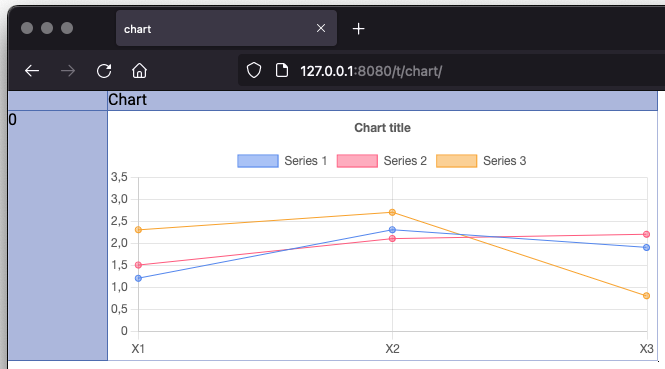
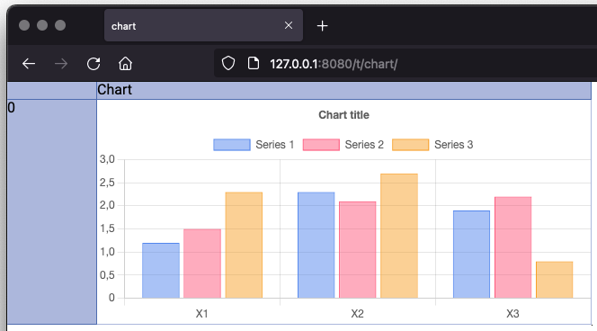
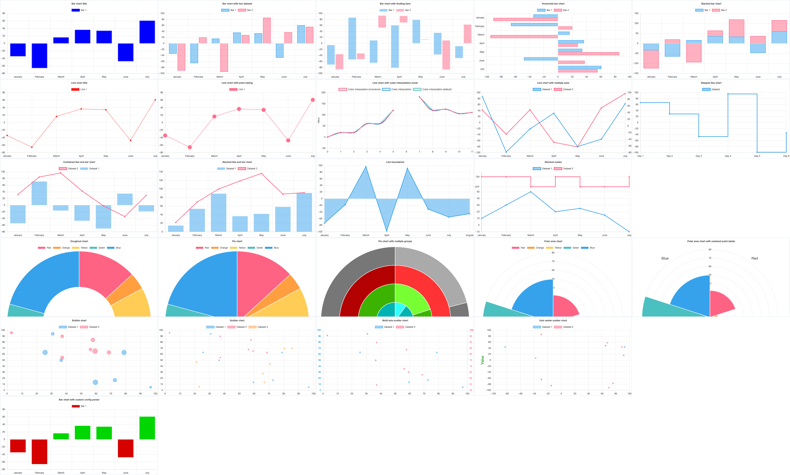

# Charts

Like with functions, Sigbla comes with charting capabilities. The charting capabilities of Sigbla make use of
[chart.js](https://www.chartjs.org/), with out-of-the-box support for the 8 chart types that come with chart.js. The
chart data model is also flexible, allowing for extended integration between Sigbla and chart.js.

Unlike functions, as described in the previous chapter, charts live within their own package `sigbla.charts`.
To use charts make sure to do `import sigbla.charts.*` in addition to the usual `import sigbla.app.*`.

## Line chart

The next example shows how to create a line chart with static data.

``` kotlin
import sigbla.app.*
import sigbla.charts.*

fun main() {
    TableView[Port] = 8080

    val table = Table["chart"]
    val tableView = TableView[table]

    val title = "Chart title"
    val xLabels = listOf("X1", "X2", "X3")
    val series1 = "Series 1" to listOf(1.2, 2.3, 1.9)
    val series2 = "Series 2" to listOf(1.5, 2.1, 2.2)
    val series3 = "Series 3" to listOf(2.3, 2.7, 0.8)

    // Define the line chart, title is optional
    tableView["Chart", 0] = line(
        title,
        xLabels,
        series1, series2, series3
    )

    tableView[0][CellHeight] = 250
    tableView["Chart"][CellWidth] = 550

    val url = show(tableView)
    println(url)
}
```

Loading this, we'll find the line chart as expected.



Instead of using static data, we can also link the chart to cell data. That would cause the chart to automatically
update when the underlying data is updated.

``` kotlin
import sigbla.app.*
import sigbla.charts.*

fun main() {
    TableView[Port] = 8080

    val dataTable = Table["data"]

    dataTable["Title", 0] = "Chart title"

    dataTable["X Labels", 0] = "X1"
    dataTable["X Labels", 1] = "X2"
    dataTable["X Labels", 2] = "X3"

    dataTable["Series 1", 0] = 1.2
    dataTable["Series 1", 1] = 2.3
    dataTable["Series 1", 2] = 1.9

    dataTable["Series 2", 0] = 1.5
    dataTable["Series 2", 1] = 2.1
    dataTable["Series 2", 2] = 2.2

    dataTable["Series 3", 0] = 2.3
    dataTable["Series 3", 1] = 2.7
    dataTable["Series 3", 2] = 0.8

    val chartTable = Table["chart"]
    val tableView = TableView[chartTable]

    // Define the line chart using data from cells
    tableView["Chart", 0] = line(
        dataTable["Title", 0],
        dataTable["X Labels", 0]..dataTable["X Labels", 2],
        "Series 1" to dataTable["Series 1", 0]..dataTable["Series 1", 2],
        "Series 2" to dataTable["Series 2", 0]..dataTable["Series 2", 2],
        "Series 3" to dataTable["Series 3", 0]..dataTable["Series 3", 2],
    )

    tableView[0][CellHeight] = 250
    tableView["Chart"][CellWidth] = 550

    val url = show(tableView)
    println(url)
}
```

## Bar chart

The parameters for a bar chart follow that of the line chart. To get a bar chart, simply replace `line` with `bar`:

``` kotlin
tableView["Chart", 0] = bar(
    title,
    xLabels,
    series1, series2, series3
)
```

``` kotlin
tableView["Chart", 0] = bar(
    dataTable["Title", 0],
    dataTable["X Labels", 0]..dataTable["X Labels", 2],
    "Series 1" to dataTable["Series 1", 0]..dataTable["Series 1", 2],
    "Series 2" to dataTable["Series 2", 0]..dataTable["Series 2", 2],
    "Series 3" to dataTable["Series 3", 0]..dataTable["Series 3", 2],
)
```

This will produce a bar chart like so:



## Other chart types

The first two examples should give you a feel for how you make use of charts in Sigbla. Other types of charts that are
supported include: Bubble and scatter charts, doughnut and pie charts, in addition to polar area and radar charts.

You can find examples of all of these on GitHub within the
[sigbla.examples.charts package](https://github.com/sigbla/sigbla-app/tree/master/examples/src/main/kotlin/sigbla/examples/charts).



## Directly defining the chart model

Before the chart is rendered, the relevant data is sent to the browser as JSON. This JSON is made using the content
of the [chart model](https://github.com/sigbla/sigbla-app/blob/master/charts/src/main/kotlin/sigbla/charts/ChartModel.kt).

If you need to make more advanced charts than what is directly supported by the various chart functions, you have two
options:

### Create a chart from scratch with chart { }

Instead of using `bar(..)`, `line(..)`, and other such functions, you can use `chart` and then set up the chart model
yourself as shown next:

``` kotlin
tableView["Chart", 0] = chart {
    type = ChartType.Bar
    data = ChartModel.Data(
        labels = Strings("January", "February", "March", "April", "May", "June", "July"),
        datasets = ChartModel.Data.Datasets(
            ChartModel.Data.Datasets.Dataset(
                label = Text("Bar 1"),
                data = Numbers(-34.39986283, -65.76646091, 16.24142661, 36.31515775, 33.96090535, -47.61145405, 60.73388203),
                borderColor = Color.RGBA(0, 0, 255, 0.9),
                backgroundColor = Color.RGBA(0, 0, 255, 1.0),
                borderWidth = Numeric(2)
            )
        )
    )
    options = ChartModel.Options(
        responsive = Bool.True,
        plugins = ChartModel.Options.Plugins(
            legend = ChartModel.Options.Plugins.Legend(
                position = Position.Top
            ),
            title = ChartModel.Options.Plugins.Title(
                display = Bool.True,
                text = Text("Bar chart title")
            )
        ),
        animation = ChartModel.Options.Animation(
            duration = Numeric(0)
        )
    )
}
```

This example will set up a bar chart from scratch, giving you full flexibility to create the model as needed.

### Customize an existing chart

Instead of starting from scratch, another approach is to customize an existing chart. Next we'll show this using the
[bubble chart example](https://github.com/sigbla/sigbla-app/tree/master/examples/src/main/kotlin/sigbla/examples/charts/BubbleChart.kt),
where we define the min and max x and y-axis values:

``` kotlin
tableView["Chart", 0] = bubble(
    title, "Dataset 1" to dataset1, "Dataset 2" to dataset2
) {
    val options = this.options ?: ChartModel.Options()
    val scales = options.scales ?: ChartModel.Options.Scales()
    val xScale = scales.values?.getOrDefault("x", ChartModel.Options.Scales.Scale()) ?: ChartModel.Options.Scales.Scale()
    val yScale = scales.values?.getOrDefault("y", ChartModel.Options.Scales.Scale()) ?: ChartModel.Options.Scales.Scale()

    xScale.min = Numeric(0)
    xScale.max = Numeric(250)

    yScale.min = Numeric(0)
    yScale.max = Numeric(250)

    scales.values = (scales.values ?: mapOf()).toMutableMap().apply {
        this["x"] = xScale
        this["y"] = yScale
    }

    options.scales = scales
    this.options = options
}
```

## Client side model parsing

It's possible to make use of client side JavaScript to further customize the chart. This is supported via the
parser option. We see this in action below:

``` kotlin
tableView[Resource["custom-chart-parser.js"]] = js {
    """
        window.customChartParser = function(config) {
            const cfn = function colorize() {
                  return (ctx) => {
                        // Change bar color based on its value
                        const v = ctx.parsed.y;
                        const c = v < 0 ? '#D60000' : '#00D600';
                        return c;
                  };
            }

            config.options.elements = { bar: { backgroundColor: cfn() } };
        }
    """.trimIndent()
}

// Bar chart with custom parser
tableView["Chart", 0] = chart {
    parser = "window.customChartParser"
    type = ChartType.Bar
    data = ChartModel.Data(
        labels = Strings("January", "February", "March", "April", "May", "June", "July"),
        datasets = ChartModel.Data.Datasets(
            ChartModel.Data.Datasets.Dataset(
                label = Text("Bar 1"),
                data = Numbers(-34.39986283, -65.76646091, 16.24142661, 36.31515775, 33.96090535, -47.61145405, 60.73388203)
            )
        )
    )
    options = ChartModel.Options(
        responsive = Bool.True,
        plugins = ChartModel.Options.Plugins(
            title = ChartModel.Options.Plugins.Title(
                display = Bool.True,
                text = Text("Bar chart with custom config parser")
            )
        ),
        animation = ChartModel.Options.Animation(
            duration = Numeric(0)
        )
    )
}
```

This works by first making a custom resource available, here hosted under `custom-chart-parser.js`, and then making use
of that on the chart by defining `parser = "window.customChartParser"`.

If you're not familiar with Sigbla resources, as defined with `Resource["custom-chart-parser.js"]` above, then these
are covered under the [view resources](view_resources.md) chapter.