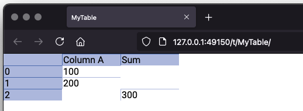

# Introduction to Sigbla

Sigbla is a framework for working with data in tables, using the Kotlin programming language.
It supports [various data types](cells.md), [reactive programming and events](table_subscriptions.md),
[user input](widgets.md), [charts](charts.md), among other things.

We're probably all used to working with data in tables, using applications like Microsoft Excel or Google Sheets.
Those are great, and used by many for all sorts of reasons. But they've got some shortcomings, such as:

* Mixing code, data, and presentation into the same sheet
* Performance challenges when doing a lot of calculations
* Usability limitations for larger quantities of data

These issues make them difficult to maintain and understand, and limits how much we sanely want to do with them.

Sigbla fixes this by:

* Providing an easy to use table structure for data
* With programming residing in source code files
* And letting you view the data through views

Sigbla also provides other things, like extending and making easier how we can do math in Kotlin,
and, as mentioned, allows us to wire together relationships between cells through reactive programming.

## Getting started

You can make use of Sigbla in your Kotlin projects by declaring it as a dependency.

Include it in your Gradle build file like so:

```
repositories {
    maven { url = uri("https://mvn.sigbla.app/repository") }
}

dependencies {
    implementation("sigbla.app:sigbla-app-all:1.+")
}
```

Please also consult the [Sigbla sample project](https://github.com/sigbla/sigbla-sample) for a working Gradle example.

However, you don't need a full project setup and can also use a Kotlin REPL, such as [kscript](https://github.com/kscripting/kscript).

Assuming you have kscript installed, here's a quick example:

``` kotlin
#!/usr/bin/env kscript

@file:Repository("https://mvn.sigbla.app/repository")
@file:DependsOn("sigbla.app:sigbla-app-all:[1.23,)")

import sigbla.app.*

val table = Table["MyTable"]

table["Column A", 0] = 100
table["Column A", 1] = 200

table["Sum", 2] = sum(table["Column A", 0], table["Column A", 1])

val tableView = TableView[table]

val url = show(tableView)
println(url)
```

It's a basic example that puts the values 100 and 200 into a cell each, before assigning the sum of these to a separate
column we label "Sum" at row 2.

Because of the reactive nature of `sum(..)`, if the values update, so will the sum.

Let's walk through the various sections:

``` kotlin
#!/usr/bin/env kscript

@file:Repository("https://mvn.sigbla.app/repository")
@file:DependsOn("sigbla.app:sigbla-app-all:[1.23,)")
```

The first line allows us to run this script as an executable, assuming kscript is available.

Then we configure the repository where Sigbla is available and add the dependency with
`@file:Repository(..)` and `@file:DependsOn(..)`.

``` kotlin
import sigbla.app.*
```

Doing an import of `sigbla.app.*`, with the star, is important, rather than importing individual classes and functions.
This is to ensure you get all the expected functionality needed.

``` kotlin
val table = Table["MyTable"]
```

This creates a table, named MyTable. The name is optional, and could be `null`, but by giving it a name we can easily
find it later through the built-in registry. You can obtain a reference to an existing table by doing `Table.fromRegistry(name)`.

``` kotlin
table["Column A", 0] = 100
table["Column A", 1] = 200
```

Here we assign 100 and 200 to their respective cells. The first cell is put into a column with the name "Column A" at
row zero. The second value is put into the same column but at the row below.

Cells support different types of values, such as integers, but also floating points or strings, to name two. If you
wanted to put a string into a cell, simply do `table["Column B", 0] = "some string value"`.

Next, we are using the sum function to put the sum of our two cells into another cell:

``` kotlin
table["Sum", 2] = sum(table["Column A", 0], table["Column A", 1])
```

As said earlier, the sum function is reactive, and it will be told about changes made to the cells it is referring to.
This allows it to automatically update the sum value whenever any of its inputs are updated, like we would expect in a
traditional spreadsheet application.

Finally, we want to have a look at our table, and we do that by creating what's known as a `TableView`, passing the
relevant table in, before calling `show(tableView)`. This gives us a URL we can open in the browser, to view our table
much like any other spreadsheet.

``` kotlin
val tableView = TableView[table]

val url = show(tableView)
println(url)
```



Please note that the port in your URL is unlikely to be the same as shown in the above screenshot, so look for
your particular URL printed to the console when executing `show(tableView)`.

Also worth being aware of is that you can do `print(table)` if you just need a quick console output:

``` kotlin
print(table)

// Output:
//          |Column A |Sum      
// 0        |100      |         
// 1        |200      |         
// 2        |         |300      
```


We've just scratched the surface of what's possible. Continue learning about [tables](tables.md) and [views](views.md) next.

## Background and current state of this software

Sigbla has been a long-time hobby project of mine, one that stems from me wanting to be able to easily work with data
on the JVM using Kotlin. There are still some features and test cases missing. Because of this, I would currently
consider this alpha software. The APIs might change and bugs are expected.

If you find any issues or have some suggestions, please reach out using GitHub [issues](https://github.com/sigbla/sigbla-app/issues)
or [discussions](https://github.com/sigbla/sigbla-app/discussions). All feedback welcome while I work towards getting
this production ready.