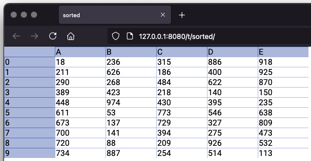
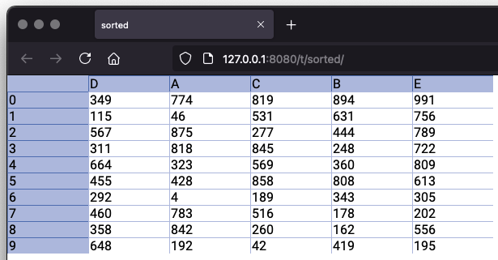

# Utils

In earlier chapters you've already seen various utility functions being used. Below, we'll mention them again together
with others.

## Print table

The `print` function allows us to get a quick view on the content of a table. You can call `print(table)` to get the
output printed to the console.

You can also pass in a writer, doing `print(table, writer)`, handy if you for example want to save the output to a file:

``` kotlin
import sigbla.app.*
import java.io.FileWriter

fun main() {
    val table = Table[null]

    table["A", 0] = "A0"
    table["A", 1] = "A1"

    table["B", 0] = "B0"
    table["B", 1] = "B1"

    FileWriter("output.txt").use { writer ->
        print(table, writer)
    }
}
```

## Show table and table view

As seen many times, we can call `show(tableView)` to get a URL that we can open in a browser for us to view the table
through the provided table view. We can also do `show(table)`, which is shorthand for `show(TableView[table])`.

Usually, the URL will be `http://host:port/t/{ref}/` with `{ref}` being whatever the name of the table or table view is.
This might not produce the desired URL, so you may specify the ref yourself by passing it in as a second parameter to
show: `show(tableView, ref)`. Passing in a `ref` value is also required if the name of the table or table view isn't
defined.

A third argument to `show` allows you to pass in a function that is responsible for generating the returned URL. The
default implementation of this function is as shown next, and used when not otherwise provided:

``` kotlin
(engine: ApplicationEngine, view: TableView, ref: String) -> URL = { engine, _, ref ->
    val type = engine.environment.connectors.first().type.name
    val host = engine.environment.connectors.first().host
    val port = engine.environment.connectors.first().port
    URL("$type://$host:$port/t/${ref}/")
}
```

Returning a different URL does not change what the actual URL used by the backend would be, but it allows you to
gain access to the engine, and is useful if you're proxying access to the backend somehow and would need to
better control the returned URL for those reasons.

## Table values

For table values, stored within cells, we have a function called `valueOf` which allows us to do type filtering.
If the type doesn't match, we'll get a null instead.

``` kotlin
val table = Table[null]

table["A", 0] = 1
table["A", 1] = "Not a number"

val v1: Long? = valueOf(table["A", 0])
val v2: Long? = valueOf(table["A", 1])

println("v1: $v1")
println("v2: $v2")

// Output:
// v1: 1
// v2: null
```

You can also use the `valueOf` function to get the result of applying a function, such as `sum`, without needing to
assign the function to a cell first. This is a one-off call to the function, without it sticking around afterward.

``` kotlin
val table = Table[null]

table["A", 0] = 1
table["A", 1] = 2
table["A", 2] = 3

val sum: Long? = valueOf(sum(table["A"]))

println(sum)

// Output
// 6
```

Similarly, there's a `valuesOf`, which operate on a sequence of cells:

``` kotlin
val table = Table[null]

table["A", 0] = 1
table["A", 1] = "Not a number"
table["A", 2] = 3

val vs = valuesOf<Long>(table["A"])

println("vs: ${vs.toList()}")

// Output:
// vs: [1, 3]
```

## Table header, column, index

Obtaining the header of a column can be done via multiple types, both on a `Column` instance, but also on a `Cell`
instance. The same for a row index, both via a `Row` instance, or again a `Cell` instance.

For easing this and similar cases, there exists a group of utility functions called `headerOf(..)`, `headersOf(..)`,
`columnOf(..)`, `columnsOf(..)`, `indexOf(..)`, and `indexesOf(..)`.

## Swapping rows or columns

It's possible to swap rows or columns using the `swap` function. It will, as the name indicates, swap the values
between the selected pair of rows or columns as shown in the next example:

``` kotlin
val table = Table[null]

table["A", 0] = "A0"
table["A", 1] = "A1"
table["A", 2] = "A2"
table["B", 0] = "B0"
table["B", 1] = "B1"
table["B", 2] = "B2"
table["C", 0] = "C0"
table["C", 1] = "C1"
table["C", 2] = "C2"

// Swap column A and C
swap(table["A"], table["C"])

print(table)

// Output:
//    |A  |B  |C
// 0  |C0 |B0 |A0
// 1  |C1 |B1 |A1
// 2  |C2 |B2 |A2

// Swap row 1 and 2
swap(table[1], table[2])

// Output:
//    |A  |B  |C  
// 0  |C0 |B0 |A0 
// 1  |C1 |B1 |A1 
// 2  |C2 |B2 |A2 
```

The two row or column references may also be between different tables, such as `swap(t1["A"], t2["B"])` or
`swap(t1[2], t2[1])`.

## Table sorting

You can sort the content of a table, either by rows or by columns, with the `sort` function. Looking at sorting by
rows first, you'll see that we provide a comparison function which is asked to compare one row to another:

``` kotlin
import sigbla.app.*
import java.util.concurrent.ThreadLocalRandom

fun main() {
    TableView[Port] = 8080
    val view = TableView[null]
    println(show(view, ref = "sorted"))

    val table = Table[null]
    view[Table] = table

    for (c in listOf("A", "B", "C", "D", "E")) {
        for (r in 0 until 10) {
            table[c][r] = ThreadLocalRandom.current().nextInt(1000)
        }
    }

    // Sorting rows by values in column A
    sort(table by table[0]..table[9]) {
        row1, row2 -> row1["A"].compareTo(row2["A"])
    }
}
```

If you open the URL, you'll find something like this, where the values in column A go from low to high:



In a similar manner, sorting by columns requires a comparison function asked to compare one column to another:

``` kotlin
import sigbla.app.*
import java.util.concurrent.ThreadLocalRandom

fun main() {
    TableView[Port] = 8080
    val view = TableView[null]
    println(show(view, ref = "sorted"))

    val table = Table[null]
    view[Table] = table

    for (c in listOf("A", "B", "C", "D", "E")) {
        for (r in 0 until 10) {
            table[c][r] = ThreadLocalRandom.current().nextInt(1000)
        }
    }

    // Sorting columns by values in row 0
    sort(table by table["A"]..table["E"]) {
        column1, column2 -> column1[0].compareTo(column2[0])
    }
}
```



Only the rows or columns within the range provided are sorted, with any omitted remaining untouched.

If you want to sort in reverse order you have two options:

Use a comparison function that reverses the comparison:

``` kotlin
sort(table by table["A"]..table["E"]) {
    column1, column2 -> column2[0].compareTo(column1[0])
}
```

Reverse the row or column range by flipping the start and end points, keeping the original comparison function:

``` kotlin
sort(table by table["E"]..table["A"]) {
    column1, column2 -> column1[0].compareTo(column2[0])
}
```

Sorting by rows vs columns show us the difference between what a row represents vs what a column represents. When
sorting columns, the columns are moved around, resulting in a different column order. When sorting rows, because a
row is always ordered by the index, the values within the rows are instead moved around.

From an events point of view, this means that when a column is moved as part of sorting it, the old and new values
remain the same, with only the column order value being updated. For rows, the events will contain old and new values
related to which two rows are swapped, with the index remaining.

## Table compact

You might sometimes have a sparse table, one where rows might be empty, and you wish to compact this so that there are
no empty rows in-between rows with content.

You can do that with the `compact(table)` function:

``` kotlin
val table = Table[null]

table["A", 1] = "A1"
table["A", 4] = "A4"
table["A", 9] = "A9"

table["B", 2] = "B2"
table["B", 4] = "B4"
table["B", 6] = "B6"

// Before compact
print(table)

// Output:
//    |A  |B  
// 1  |A1 |   
// 2  |   |B2 
// 4  |A4 |B4 
// 6  |   |B6 
// 9  |A9 |   

compact(table)

// After compact
print(table)

// Output:
//    |A  |B  
// 0  |A1 |   
// 1  |   |B2 
// 2  |A4 |B4 
// 3  |   |B6 
// 4  |A9 |   
```

## View related

Table views deal with many different types of view metadata, which can make events and their contained types somewhat
open-ended. Functions such as `tableViewFromViewRelated(..)`, `columnViewFromViewRelated(..)`, `indexFromViewRelated(..)`,
and `sourceFromViewEventRelated(..)` are handy in those cases.

## View resources

Again on table views, we've seen various functions that allow us to define resources, such as `staticFile(..)`,
`staticResource(..)`, and `staticText(..)`.

And for specific types, which are also loaded by the browser when seen, we've got `js { .. }`, `jsFile(..)`, and
`jsResource(..)` for JavaScript, in addition to `css { .. }`, `cssFile(..)`, and `cssResource(..)` for Cascading Style
Sheets (CSS).
