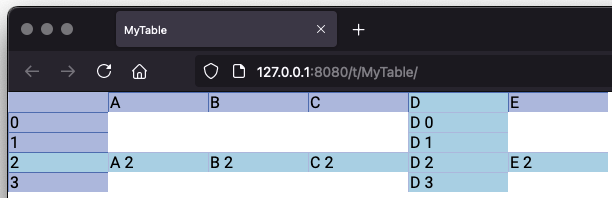
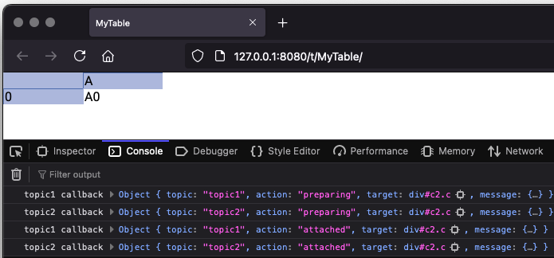

# View extensions

We saw in the previous chapter how we could add resources, and how we could include CSS and JavaScript that will be
automatically loaded by the browser when viewing the table.

We've also in a previous chapter, when looking at the derived cell view class, seen properties like `CellClasses` and
`CellTopics`.

Next we'll dive into how to make use of all of this to extend the functionality of the UI within the browser. We'll
start with an example in order to introduce the various concepts.

## Creating a clickable cell

Let's say we want a particular cell to be clickable. Each time a user clicks on the cell from their browser we'd like
this to increment the value in the cell by 1.

In order to do so, we'd like to add an `onclick` listener on that cell in the browser, and we need to load some
JavaScript for that to take place. We'll also need a resource that can listen to and take action when called from the
browser.

``` kotlin
import sigbla.app.*
import io.ktor.http.*
import io.ktor.server.request.*
import io.ktor.server.response.*
import io.ktor.server.application.*

fun main() {
    TableView[Port] = 8080

    val table = Table["MyTable"]
    val tableView = TableView[table]

    table["A", 0] = 1

    tableView["A", 0][CellTopics] = "click-cell"

    tableView[Resource["click-service"]] = {
        if (call.request.httpMethod == HttpMethod.Post) {
            println("Received a click!")
            table["A", 0] = table["A", 0] + 1
            call.respondText(text = "Click processed")
        }
    }

    tableView[Resource["my.js"]] = js {
        """
            console.log("my.js init");

            window.sigbla.onTopic("click-cell", (data) => {
                console.log("Data", data);

                if (data.action === "preparing") {
                    const cell = data.target.querySelector(".cc");
                    console.log("Target", cell);
                    if (cell == null) return;

                    const onclick = async (e) => {
                        console.log("Cell click!");
                        const response = await fetch("click-service", {
                            method: "POST"
                        });
                    }

                    cell.onclick = onclick;

                    const onkeydown = async (e) => {
                        if (e.key === " ") {
                            console.log("Marker input!");
                            const response = await fetch("click-service", {
                                method: "POST"
                            });
                        }
                    }

                    data.target.onkeydown = onkeydown;
                }
            });
        """
    }

    val url = show(tableView)
    println(url)
}
```

Many features are being used here, including resources, cell topics, and client side JavaScript code making use of
frontend Sigbla functionality, such as `window.sigbla.onTopic`. Let's start with the JavaScript code:

``` JavaScript
console.log("my.js init");

window.sigbla.onTopic("click-cell", (data) => {
    console.log("Data", data);

    if (data.action === "preparing") {
        const cell = data.target.querySelector(".cc");
        console.log("Target", cell);
        if (cell == null) return;

        const onclick = async (e) => {
            console.log("Cell click!");
            const response = await fetch("click-service", {
                method: "POST"
            });
        }

        cell.onclick = onclick;

        const onkeydown = async (e) => {
            if (e.key === " ") {
                console.log("Marker input!");
                const response = await fetch("click-service", {
                    method: "POST"
                });
            }
        }

        data.target.onkeydown = onkeydown;
    }
});
```

We start with a simple `console.log("my.js init")`, just so you can, in the browser console, see when this code is
executed. Then we make use of `window.sigbla.onTopic`, passing in `"click-cell"` as the first parameter and a function
as the second.

What we're doing here is to say: Execute this function every time a cell that belongs to the topic `click-cell` is being
processed. Cells in a table view can belong to many different topics, something we make them belong to by assigning a
`CellTopic` to them. In the example we do this with `tableView["A", 0][CellTopics] = "click-cell"`. Topics can be
placed on a cell view, a column view, a row view, or a table view itself.

Within the function we execute we're receiving a parameter we've named `data`. This JavaScript object contains various
properties, such as `target`, which points to the cell itself. We then attach an `onclick` listener to a child of this
which in turn calls our resource at a relative URL simply named "click-service".

To understand the child structure, and also the second `onkeydown` event listener, we need to understand the structure
of a cell. A cell, in the frontend, is a div with a class `c`. This div is what we get in the `data.target` field.
Within the `c` cell div we find two other divs, one with class `cc`, the other `co`. The div with the `cc` class
contains the cell content, hence where our value is placed. The `co` div is a cell overlay, which normally sits on top
of the `cc` div. Whenever a cell is double clicked, the `co` div will no longer be visible, exposing the content of `cc`.

This is why we place the `onclick` listener on `cc`. If you double click the cell, the following clicks will trigger
this `onclick` listener.

In addition, we place an `onkeydown` listener directly on `data.target`. Key down events are fired if the marker is on
the cell. Hence, if the marker is on the cell, and we press the space bar, we also want the counter to increase.

Going back to the Kotlin code, looking at the "click-service" resource, we find:

``` kotlin
tableView[Resource["click-service"]] = {
    if (call.request.httpMethod == HttpMethod.Post) {
        println("Received a click!")
        table["A", 0] = table["A", 0] + 1
        call.respondText(text = "Click processed")
    }
}
```

This simply checks that it's a POST request, and if so, increment the cell value by 1. This automatically updates the
value displayed in the browser.

The example responds to this with a simple text message. The frontend doesn't make use of this response, but that is
certainly doable if we wanted to. However, we rely on the cell update being pushed to the browser by Sigbla itself in
order to display the updated value.

## Cell lifecycle

We've seen `window.sigbla.onTopic(..)` being used within the frontend earlier. And to that function we passed a topic
and a callback function. This callback function will be invoked whenever a cell that belongs to the specified topic
is processed. To understand when a cell is processed we need to understand the lifecycle of a cell.

Cells are managed by Sigbla, as a backend to which the browser connects to. The backend is in control of what cells are
pushed to the browser, and also what cells are removed from the browser. Depending on what is happening to the table
and related table view, cells or cell content might be updated, causing a cell to be processed. Other times, due to the
user scrolling, new cells are added to the view with old cells no longer visible removed.

This means that the cells that are rendered depend on both the cells themselves (like, do they exist) and the current
view within the browser (as in, where does the user scroll to). Because multiple browsers might view the same table
concurrently, we might also have a situation where two users have scrolled to different sections of a view, and hence
are being fed different subsets of available cells.

All of this is controlled by the Sigbla backend itself. You should never, when doing frontend extensions, make any
assumptions about the availability of a cell. Don't keep references to old cells, as they might be stale.

Through the `onTopic` function, you can subscribe to cells being created and being removed. You will observe these
lifecycle events for a cell:

### Preparing

The first stage of a cell lifecycle is `preparing`, and we've seen this being checked for with `data.action === "preparing"`
at the start of this chapter.

A cell is preparing when it has been created as a DOM element, but not yet attached to the page.

### Attached

Next we find `attached`, which we can check for with `data.action === "attached"`, and will be the case just after
the cell DOM element was attached to the page.

### Removing

Much like `preparing`, we have a `removing` stage which happens just before the cell DOM element is removed from the
page. Check for this with `data.action === "removing"`.

### Removed

And again, much like `attached`, `removed` will be the stage just after a cell DOM element was removed from the page.

Check for this with `data.action === "removed"`.

### Clear

Sometimes all the cells on a page need to be removed. For efficiency, rather than going through each cell and removing
one by one, a clear event is issued. When this happens, all cells are removed from the page at once by replacing their
shared container DOM element with a new container DOM element.

You can subscribe to these events by using `window.sigbla.onClear( (data) => { .. } )`, with it taking just a single
callback function argument. The `data` object being passed to the callback function is different from the `onTopic`
object as it doesn't have a target cell. The target is instead the container for all existing cells.

You can check for this with `data.action === "clear"`.

## Cell topics and cell classes

It should be clear from the earlier sections how we can use cell topics to trigger frontend actions when cells
are processed during their various stages. What's also been mentioned, cell classes define what CSS classes to attach
to a cell DOM element.

What we haven't dived into yet is how things behave when there are multiple topics or multiple classes on a particular
cell. We'll use cell classes in the below examples, but the same applies to cell topics.

``` kotlin
val tableView = TableView[null]

// Assign cell classes
tableView["D"][CellClasses] = "cc-d"
tableView[2][CellClasses] = "cc-2"
tableView["D", 2][CellClasses] = "cc-d2"

println("Cell classes on tableView[\"D\", 2]: " + tableView["D", 2].derived.cellClasses)

// Output:
// Cell classes on tableView["D", 2]: [cc-2, cc-d, cc-d2]
```

Cell classes (and topics) combine when overlapping. Here we've assigned a cell class to the D column, another to row 2,
and a third to the cell at `["D", 2]`. When looking at the derived cell view, we find that all 3 classes have been
combined.

Cell classes and cell topics are always merged in sorted order, based on a standard string sort. It does not matter what
order they are added in.

It's also possible to have multiple classes and topics per assignment:

``` kotlin
tableView["D"][CellClasses] = setOf("cc1-d", "cc2-d")
tableView[2][CellClasses] = setOf("cc1-2", "cc2-2")
tableView["D", 2][CellClasses] = setOf("cc1-d2", "cc2-d2")

println("Cell classes on tableView[\"D\", 2]: " + tableView["D", 2].derived.cellClasses)

// Output:
// Cell classes on tableView["D", 2]: [cc1-2, cc1-d, cc1-d2, cc2-2, cc2-d, cc2-d2]
```

Like we've seen with resources already, setting cell classes or cell topics replace any existing value on them. But
we can add to the existing set like we added new resources:

``` kotlin
tableView["D"][CellClasses] = "cc1-d"
tableView[2][CellClasses] = "cc1-2"
tableView["D", 2][CellClasses] = "cc1-d2"

tableView["D"][CellClasses] = tableView["D"][CellClasses] + "cc2-d"
tableView[2][CellClasses] = tableView[2][CellClasses] + "cc2-2"
tableView["D", 2][CellClasses] = tableView["D", 2][CellClasses] + "cc2-d2"

println("Cell classes on tableView[\"D\", 2]: " + tableView["D", 2].derived.cellClasses)

// Output:
// Cell classes on tableView["D", 2]: [cc1-2, cc1-d, cc1-d2, cc2-2, cc2-d, cc2-d2]
```

An obtained CellClasses or CellTopics instance is immutable just like a Resources instance is immutable. Another
approach to the above class appending is like so:

``` kotlin
tableView["D"][CellClasses].apply { this(this + "cc2-d") }
tableView[2][CellClasses].apply { this(this + "cc2-2") }
tableView["D", 2][CellClasses].apply { this(this + "cc2-d2") }
```

And you can remove a single class like so:

``` kotlin
tableView["D"][CellClasses] = tableView["D"][CellClasses] - "cc1-d"
tableView[2][CellClasses] = tableView[2][CellClasses] - "cc1-2"
tableView["D", 2][CellClasses] = tableView["D", 2][CellClasses] - "cc1-d2"

// or

tableView["D"][CellClasses].apply { this(this - "cc1-d") }
tableView[2][CellClasses].apply { this(this - "cc1-2") }
tableView["D", 2][CellClasses].apply { this(this - "cc1-d2") }
```

Clear classes or topics by assigning a `Unit`, for example `tableView[2][CellClasses] = Unit`.

We can make use of classes and CSS resources like shown in the next example:

``` kotlin
TableView[Port] = 8080

val table = Table["MyTable"]
val tableView = TableView[table]

for (c in listOf("A", "B", "C", "D", "E")) {
    table[c, 2] = "$c 2"
}

for (r in 0..3) {
    table["D", r] = "D $r"
}

tableView["D"][CellClasses] = "specialColumn"
tableView[2][CellClasses] = "specialRow"

tableView[Resource["my.css"]] = css {
    """
        .specialColumn {
            background-color: lightblue;
        }
        .specialRow {
            background-color: lightblue;
        }
    """
}

val url = show(tableView)
println(url)
```



### Handling multiple topics

If we have multiple topics on a cell, this will potentially cause multiple `onTopic` callbacks to trigger if we
subscribe to all the topics. Here's an example of that:

``` kotlin
TableView[Port] = 8080

val table = Table["MyTable"]
val tableView = TableView[table]

tableView["A", 0][CellTopics] = setOf("topic1", "topic2")

table["A", 0] = "A0"

tableView[Resource["my.js"]] = js {
    """
        window.sigbla.onTopic("topic1", (data) => {
            console.log("topic1 callback", data);
        });
        window.sigbla.onTopic("topic2", (data) => {
            console.log("topic2 callback", data);
        });
    """
}

val url = show(tableView)
println(url)
```



## Creating a reusable click cell

The clickable cell implementation at the start of this chapter wasn't reusable. If we wanted two clickable cells, it
wouldn't be easy to reuse much of the implementation as it was done. Below is an example of how we could implement a
reusable click cell, allowing us to assign the functionality to any cell view.

A couple of key things to pay attention to is how we ensure that the callback URL is distinct for each clickable cell,
and also the cleanup logic, which removes this callback resource. When cleaning up, we're not here removing the other
resources defined by the function. If we did, we'd need to take care that no other clickable cell existed as they all
reuse some of the same resources.

``` kotlin
import sigbla.app.*
import io.ktor.http.*
import io.ktor.util.pipeline.*
import io.ktor.server.request.*
import io.ktor.server.response.*
import io.ktor.server.application.*

fun clickableCellCounter(sourceCell: Cell<*>): CellView.() -> Unit = {
    // Init if needed
    if (!sourceCell.isNumeric) sourceCell(0)

    // Ensure distinct click service for provided source cell by mixing in column and index
    val callback = "click-service-${sourceCell.column.hashCode()}-${sourceCell.index}"

    val handler: suspend PipelineContext<*, ApplicationCall>.() -> Unit = {
        if (call.request.httpMethod == HttpMethod.Post) {
            println("Received a click for ${sourceCell.column}:${sourceCell.index}")

            // Get latest cell and apply logic
            sourceCell.table[sourceCell].apply {
                if (this.isNumeric) this(this + 1)
                else this(1)
            }

            call.respondText("Click processed")
        }
    }

    val transformer: Cell<*>.() -> Unit = {
        val value = this.toString()
        this.table[this] = div("click-cell") {
            attributes["callback"] = callback
            +value
        }
    }

    this[CellTopics] = "click-cell"
    this[CellTransformer] = transformer

    tableView[Resource[callback]] = handler

    // If an existing click-service.js resource has been defined,
    // we can simply replace this with a similar new service:
    tableView[Resource["click-service.js"]] = js {
        """
            window.sigbla.onTopic("click-cell", (data) => {
                if (data.action === "preparing") {
                    const cell = data.target.querySelector(".click-cell");
                    if (cell == null) return;

                    const callback = cell.attributes.getNamedItem("callback").value;
                    if (callback === null || callback === undefined || callback.trim() === "") return;

                    const onclick = async (e) => {
                        await fetch(callback, { method: "POST" });
                    }

                    cell.onclick = onclick;

                    const onkeydown = async (e) => {
                        if (e.key === " ") {
                            await fetch(callback, { method: "POST" });
                        }
                    }
            
                    data.target.onkeydown = onkeydown;
                }
            });
        """
    }

    // Just need some CSS to ensure we can click anywhere in the cell
    tableView[Resource["click-service.css"]] = css { ".click-cell { height: 100%; }" }

    // If a new transformation is assigned on the cell view, assume this
    // means we should remove the existing clickableCellCounter.
    // Would also trigger if we clear the cell view with clear(cellView).
    on<CellTransformer<*>>(this) {
        val unsubscribe = { off(this) }
        skipHistory = true
        events {
            if (source.tableView[source][CellTransformer].function != transformer) {
                // clean up
                unsubscribe()
                source.tableView[Resource[callback]] = Unit
            }
        }
    }
}

fun main() {
    TableView[Port] = 8080

    val table = Table["MyTable"]
    val tableView = TableView[table]

    tableView["A", 0] = clickableCellCounter(table["A", 0])
    tableView["A", 1] = clickableCellCounter(table["A", 1])
    tableView["A", 2] = clickableCellCounter(table["A", 2])

    val url = show(tableView)
    println(url)
}
```
