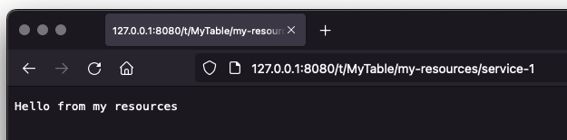
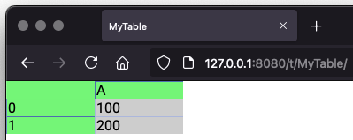

# View resources

Because the UI runs in the browser, it doesn't take much imagination to think that it would be handy to be able to
add extensions to the frontend. As seen in other chapters, this is how we're able to add charts and user input
to table views.

First step in allowing for such extensions is to be able to extend the HTTP endpoints exposed, something we'll cover
next. We then move on to describing some helper functions making it easier to add custom JavaScript and CSS.

## Adding HTTP endpoints

When viewing the table in the browser via a table view, certain endpoints are used by Sigbla in order to push
cell content to the frontend. These endpoints are hosted by the Ktor framework, embedded into Sigbla. Through what's
known as resources we're able to add custom endpoints to a selected table view.

These endpoints can accept the usual HTTP commands, such as GET and POST. This allows us to add endpoints that both
accept input and provide output.

There's no need to fiddle around with Ktor directly, because the table view exposes them through more convenient
functions. Here's an example that adds a simple endpoint returning just a text message:

``` kotlin
import sigbla.app.*
import io.ktor.server.response.*
import io.ktor.server.application.*

fun main() {
    TableView[Port] = 8080

    val table = Table["MyTable"]
    val tableView = TableView[table]

    tableView[Resources] = "my-resources/service-1" to {
        call.respondText(text = "Hello from my resources")
    }

    show(tableView)
}
```

If you run this, you can open your browser to http://127.0.0.1:8080/t/MyTable/my-resources/service-1 and get the message.



You'll notice that when we specify the resource we provide a relative URL, which is relative to the table view.

Next is an example of how you'd allow for a basic POST request:

``` kotlin
import sigbla.app.*
import io.ktor.server.response.*
import io.ktor.server.application.*
import io.ktor.server.request.*

fun main() {
    TableView[Port] = 8080

    val table = Table["MyTable"]
    val tableView = TableView[table]

    tableView[Resources] = "my-resources/service-2" to {
        val name = call.receiveText()
        call.respondText(text = "Hello $name")
    }

    show(tableView)
}
```

You could test this out with curl for example:

``` shell
$ curl --data "World" http://127.0.0.1:8080/t/MyTable/my-resources/service-2
Hello World
```

If you wanted to define more than one resource and do this as done in the next example it wouldn't work. That's because
you reassign the resources provided with the second assignment, much like you set any other type of value on a table
or a table view.

``` kotlin
import sigbla.app.*
import io.ktor.server.response.*
import io.ktor.server.application.*
import io.ktor.server.request.*

fun main() {
    TableView[Port] = 8080

    val table = Table["MyTable"]
    val tableView = TableView[table]

    tableView[Resources] = "my-resources/service-1" to {
        call.respondText(text = "Hello from my resources")
    }
    
    // NOTE: This will replace the previous service, removing it
    tableView[Resources] = "my-resources/service-2" to {
        val name = call.receiveText()
        call.respondText(text = "Hello $name")
    }

    show(tableView)
}
```

Instead, if you actually don't want to remove the first resource, you need to add to it like so:

``` kotlin
tableView[Resources] = "my-resources/service-1" to {
    call.respondText(text = "Hello from my resources")
}

tableView[Resources] = tableView[Resources] + ("my-resources/service-2" to {
    val name = call.receiveText()
    call.respondText(text = "Hello $name")
})
```

The resources on a table view represent an immutable set of services, so you'd need to take the old and add to it.
There are neater ways of adding multiple services:

``` kotlin
tableView[Resources] = tableView[Resources] + listOf(
    "my-resources/service-1" to {
        call.respondText(text = "Hello from my resources")
    },

    "my-resources/service-2" to {
        val name = call.receiveText()
        call.respondText(text = "Hello $name")
    }
)
```

You can also clean up and remove services you don't want anymore like so, by providing the URL:

``` kotlin
tableView[Resources] = tableView[Resources] - "my-resources/service-1"
```

## Making available static resources

Often you just need to include some static content, and there are a few options for that:

``` kotlin
tableView[Resources] = tableView[Resources] + listOf(
    "my-resources/file-1.jpg" to staticResource("/some-folder/file.jpg"),
    "my-resources/file-2.jpg" to staticFile(File("/file-path/file.jpg"))
)
```

For the first resource, we use `staticResource` to pass the path to a file within our resources. Resources are usually
packaged together with your code in a jar file, located within the project `resources` folder, making it easy to
include these without needing separate files.

The second example uses `staticFile`, which instead looks for the file somewhere on your filesystem.

There's also one called `staticText`, which allows us to simplify our first example service somewhat:

``` kotlin
import sigbla.app.*
import io.ktor.http.*

fun main() {
    TableView[Port] = 8080

    val table = Table["MyTable"]
    val tableView = TableView[table]

    tableView[Resources] = tableView[Resources] + listOf(
        "my-resources/service-1" to staticText(
            contentType = ContentType.Text.Plain,
            text = "Hello from my resources"
        )
    )

    show(tableView)
}
```

You see that we specify the content type, which might give you some ideas as to how you could serve CSS and JavaScript.
But if you did it through `staticText`, or `staticFile` or `staticResource` (who also would work out the right
content type by looking at the file extension), how would you ensure the browser actually loaded these resources?

## Automatically loading CSS and JavaScript

It's not enough to just add some CSS or JavaScript code as a resource if you want to make use of it in the browser.
You'll also need to ensure the browser actually loads these resources so that they become available to make use of.

This is where functions like `css`, `cssFile`, `cssResource` for CSS content, together with `js`, `jsFile`, and
`jsResource` for JavaScript, get involved.

The next chapter on view extensions cover this in more detail, but let's look at a quick example changing the CSS so
that we can change the default colors of a table:

```
TableView[Port] = 8080

val table = Table["MyTable"]
val tableView = TableView[table]

table["A", 0] = 100
table["A", 1] = 200

tableView[Resources] = tableView[Resources] + ("my.css" to css {
    """
        .tc, .ch, .ch:hover, .bb, .rb, .rh, .rh:hover {
            background-color: lightgreen;
        }
        .c {
            background-color: lightgray;
        }
        .c:hover {
            background-color: gray;
        }
    """
})

show(tableView)
```

This produces a lovely looking table with our custom color scheme:


