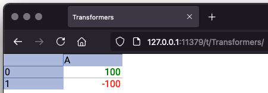

# Views

We've seen `TableView` in action already, but we haven't yet explained it in much detail. We'll start doing that now.

The purpose of a table view is to describe how you'd want to display your table. As has been mentioned already,
separating your data from its view helps create more maintainable applications, and it also allows you to attach
several different views to the same data.

## Creating views

You can create a `TableView` by providing it a `Table`. This makes the created view belong to the provided table.
But you can also create views without tying it to a table, and then later on bind the view to a table. This also allows
you to change which table the view binds to later on, handy for when you want to swap out the viewed data.

Just like there's a table registry, there is a view registry. Overall, the APIs provided by `TableView` should feel
familiar as they follow the same patterns as those used on `Table`. A `TableView` however is still very different from
`Table`, as the view describes how to display data rather than holding data.

The boundary between what is data and what is metadata can sometimes be unclear. One might think that the order of
columns should be something a view could dictate. But the order of columns is defined in the table, as it is considered
part of the data structure, rather than metadata. This is similar to how the order of rows is defined by their index,
which is a property of cells on tables.

Let's continue with an example of some of the features of `TableView`:

``` kotlin
// Create a TableView that's not tied to any Table
val tableView = TableView[null]

// Set the width of column B
tableView["B"][CellWidth] = 100

// Set the height of row 1
tableView[1][CellHeight] = 10

// Set height and width on a particular cell
tableView["C", 2][CellHeight] = 20
tableView["C", 2][CellWidth] = 80
```

Cells can have a height and a width. These can either be defined for a particular cell or across all cells within a
column or a row. Rows don't have a width, so doing `tableView[1][CellWidth]` isn't possible. Similarly, columns don't
have a height, thus `tableView["A"][CellHeight]` also isn't possible.

The numbers provided above represent pixel height and width when displaying the table. Let's look at the type of these
when reading from a `TableView`:

``` kotlin
val tableView = TableView[null]

// Read from an empty table view:
val cellHeight1 = tableView[1][CellHeight]
val cellWidth1 = tableView["B"][CellWidth]

println(cellHeight1::class)
println(cellWidth1::class)

// Output:
// class sigbla.app.UnitCellHeight
// class sigbla.app.UnitCellWidth

// Add some values to these
tableView[1][CellHeight] = 10
tableView["B"][CellWidth] = 100

val cellHeight2 = tableView[1][CellHeight]
val cellWidth2 = tableView["B"][CellWidth]

println(cellHeight2::class)
println(cellWidth2::class)

// Output:
// class sigbla.app.PixelCellHeight
// class sigbla.app.PixelCellWidth
```

Much like we had UnitCell from an empty cell on a table, we find a similar pattern for a table view. When not defined,
the cell height is represented by the `UnitCellHeight`, but when set, we get a `PixelCellHeight`. We see `UnitCellWidth`
and `PixelCellWidth` for width.

What happens at the intersection between column B and row 1 above? Let's find out:

``` kotlin
val tableView = TableView[null]

tableView[1][CellHeight] = 10
tableView["B"][CellWidth] = 100

val cellView = tableView["B", 1]
val cellHeight = cellView[CellHeight]
val cellWidth = cellView[CellWidth]

println(cellHeight::class)
println(cellWidth::class)

// Output:
// class sigbla.app.UnitCellHeight
// class sigbla.app.UnitCellWidth
```

For the particular cell at `["B", 1]`, you'll notice that the height and width remain undefined, giving us `UnitCellHeight`
and `UnitCellWidth`, even after defining height and width on the relevant row and column. The height and width are defined
separately on a cell view, row view and column view. If we were to set the height and width on the cell itself, then our
`cellHeight` and `cellWidth` would become `PixelCellHeight` and `PixelCellWidth` instead:

``` kotlin
val tableView = TableView[null]

tableView["B", 1][CellHeight] = 10
tableView["B", 1][CellWidth] = 100

val cellView = tableView["B", 1]
val cellHeight = cellView[CellHeight]
val cellWidth = cellView[CellWidth]

println(cellHeight::class)
println(cellWidth::class)

// Output:
// class sigbla.app.PixelCellHeight
// class sigbla.app.PixelCellWidth
```

## Derived cell views

Being able to define height and width on an individual cell allows us to override any settings defined on its column and
row. Height and width on a cell hence take precedence over those defined on more overarching structures.

You might not want to first read the width of a cell and then move on to the column if undefined when working out a
particular cell width, as that would be a bit tedious. You can instead make use of what's known as a `DerivedCellView`:

``` kotlin
val tableView = TableView[null]

tableView[1][CellHeight] = 30
tableView["B"][CellWidth] = 120

tableView["B", 1][CellHeight] = 40
tableView["B", 1][CellWidth] = 150

val cellView1 = tableView["B", 1]
val derivedCellView1 = cellView1.derived

println("Cell height at [\"B\", 1]: ${derivedCellView1.cellHeight}")
println("Cell width at [\"B\", 1]: ${derivedCellView1.cellWidth}")

// Output:
// Cell height at ["B", 1]: 40
// Cell width at ["B", 1]: 150

val derivedCellView2 = tableView["B", 2].derived

println("Cell height at [\"B\", 2]: ${derivedCellView2.cellHeight}")
println("Cell width at [\"B\", 2]: ${derivedCellView2.cellWidth}")

// Output:
// Cell height at ["B", 2]: 20
// Cell width at ["B", 2]: 120

val derivedCellView3 = tableView["A", 1].derived

println("Cell height at [\"A\", 1]: ${derivedCellView3.cellHeight}")
println("Cell width at [\"A\", 1]: ${derivedCellView3.cellWidth}")

// Output:
// Cell height at ["A", 1]: 30
// Cell width at ["A", 1]: 100

val derivedCellView4 = tableView["A", 2].derived

println("Cell height at [\"A\", 2]: ${derivedCellView4.cellHeight}")
println("Cell width at [\"A\", 2]: ${derivedCellView4.cellWidth}")

// Output:
// Cell height at ["A", 2]: 20
// Cell width at ["A", 2]: 100
```

The `DerivedCellView` instance provides us with access to all the settings applied when viewing a particular
cell by combining everything that is defined within the TableView and related entities. It's a fully immutable view
of these definitions as they existed when creating the instance.

``` kotlin
val derivedCellView = TableView[null]["A", 1].derived

val cell: Cell<*>? = derivedCellView.cell
val cellHeight: Long = derivedCellView.cellHeight
val cellWidth: Long = derivedCellView.cellWidth
val cellView: CellView = derivedCellView.cellView
val columnView: ColumnView = derivedCellView.columnView
val index: Long = derivedCellView.index
val tableView: TableView = derivedCellView.tableView
val cellClasses: CellClasses<DerivedCellView> = derivedCellView.cellClasses
val cellTopics: CellTopics<DerivedCellView> = derivedCellView.cellTopics
```

Height and width are worked out by taking the most specific cell view values applicable to the relevant cell as outlined
next.

Rules for cell height:

* If the height is defined on the relevant `CellView`, use this
* Otherwise, if the height is defined on the relevant `RowView`, use this
* Otherwise, if the height is defined on the relevant `TableView`, use this
* Finally, if not defined anywhere, use a fixed default of 20 pixels

The fixed default is defined on `sigbla.app.DEFAULT_CELL_HEIGHT`, which means all cells must have a height.

For width, the rules are comparable:

* If the width is defined on the relevant `CellView`, use this
* Otherwise, if the width is defined on the relevant `ColumnView`, use this
* Otherwise, if the width is defined on the relevant `TableView`, use this
* Finally, if not defined anywhere, use a fixed default of 100 pixels

The fixed default is defined on `sigbla.app.DEFAULT_CELL_WIDTH`, which means all cells must have a width.

We've seen above how we can set the height and width on cell views, row views, and column views, but not on the
`TableView`. It should come as no surprise how this is defined:

``` kotlin
val tableView = TableView[null]

tableView[CellHeight] = 30
tableView[CellWidth] = 200
```

As with the index on a `Cell`, convenience functions allow you to define height and width using `Int`, but internally
they are all stored as a `Long`.

Coming back to the `DerivedCellView` properties, you'll notice you have access to the `Cell` it represents, but as a
nullable variant. This is because the table view might not be connected with a table, making nulls needed.

There's also something called `CellClasses` and `CellTopics`, which we'll come back to in the chapter on view
extensions. While topics require a bit more context, we can say classes contain CSS classes we want to apply to the
cell itself when viewed in a web browser. These are different to the classes we applied to `WebContent` on a `WebCell`
as the `CellClasses` apply to the cell container itself, not its content.

We'll also get back to the generics used on `CellClasses` and `CellTopics` in the chapter on view subscriptions.

## Iterating over derived cell views

On `TableView`, `ColumnView`, `RowView`, `CellView` and so on, you're able to create iterators that give you all the derived cell
views on these. However, please note that these iterators only produce derived cell views for those that have
corresponding cells in the connected table.

The next example illustrates this:

``` kotlin
fun assert(value: Boolean) {
    if (!value) { throw AssertionError() }
}

val table1 = Table["T1"]
val table2 = Table["T2"]

val tableView = TableView[null]
tableView["A"][CellWidth] = 200
tableView[1][CellHeight] = 25

// This iterator does not give us any derived cell views
// because we don't have any underlying cells
val emptyIterator = tableView.iterator()
assert(!emptyIterator.hasNext())

table1["A", 1] = 100

// Associate the view with table1
tableView[Table] = table1

val iterator1 = tableView.iterator()
iterator1.forEach {
    println(it)
}

// Output:
// DerivedCellView(columnView=[A], index=1, cellHeight=25, cellWidth=200, tableView=TableView[null], cellView=[A]:1, cell=100, cellClasses=[], cellTopics=[])

// Swapping the table associated with the view will then
// create iterators based on the cells in table2
table2["B", 2] = 200
tableView[Table] = table2

val iterator2 = tableView.iterator()
iterator2.forEach {
    println(it)
}

// Output:
// DerivedCellView(columnView=[B], index=2, cellHeight=20, cellWidth=100, tableView=TableView[null], cellView=[B]:2, cell=200, cellClasses=[], cellTopics=[])
```

## Cell transformations

A table view allows us to define something called cell transformers on selected cell views. A cell transformer allows us
to change how a cell is presented in the view. It doesn't in any way change the original cell from the underlying table,
but potentially transforms the cell into another cell.

Back when introducing `WebCell` in the chapter on cells, we said it was somewhat problematic to embed HTML content
directly into a table for the purposes of changing how the content is presented, as it ties the data with the view.
Cell transformers allow us to break this link.

We can with a transformer take cell values and transform them into whatever we want, which could include HTML
content for the purpose of elevating or changing how data is viewed, again without this impacting the original cell data.

Here's an example that changes the text color to red if the number is negative, otherwise green:

``` kotlin
val table = Table["Transformers"]
val tableView = TableView[table]

table["A", 0] = 100
table["A", 1] = -100

table["A"].forEach {
    tableView[it][CellTransformer] = {
        if (!isNumeric) it
        else if (asDouble!! > 0) div {
            p {
                attributes += "style" to "color: green; text-align: right"
                +it.toString()
            }
        } else div {
            p {
                attributes += "style" to "color: red; text-align: right"
                +it.toString()
            }
        }
    }
}

val url = show(tableView)
println(url)
```

This is, as explained for the `WebCell` in the chapter on cells using `kotlinx.html` so an `import kotlinx.html.*` is
recommended to ensure all tags are available for ease of use.



The definition of a cell transformer is `CellTransformer<T>`, which is a class that comes with two concrete
implementations, `UnitCellTransformer` and `FunctionCellTransformer`. In the example above we defined a function to
perform the transformation, which would cause us to obtain a reference to a `FunctionCellTransformer` should we after
adding it do a `tableView[ref][CellTransformer]`, with ref being one of the possible references, such as a `CellView`.
If no transformer was defined on the reference, we'd obtain a `UnitCellTransformer`, indicating no transformation.

The type T on FunctionCellTransformer is `Cell<*>.() -> Any?`, indicating that anything can be returned from it. However,
whatever is returned must be accepted as a cell value on a table.

It's also important that the transformation function is pure, hence should always return the same output given the
same input. If they don't, unexpected behavior is to be assumed.

You can obtain a `Table` instance from a table view that apply all the transformations defined by calling
`tableView[Table]`:

``` kotlin
val table = Table["Transformers"]
val tableView = TableView[table]

table["A", 0] = 100
table["A", 1] = -100

table["A"].forEach {
    tableView[it][CellTransformer] = { if (isNumeric) it * 2 else it }
}

val transformedTable = tableView[Table]

print(transformedTable)

// Output
//      |A    
// 0    |200  
// 1    |-200 
```

The returned table, `transformedTable`, is a clone of the table tied to the view, here `table`. If no table was tied to
the view, then an empty table would have been returned.

This makes views somewhat useful outside just UIs, as they can be used to apply transformation for data purposes. In
any case it helps with debugging and testing UI transformations as you gain access to what the UI would receive.

Finally, it's worth noting that cell transformers are currently only supported directly tied to a `CellView`. Extending
this support to other reference types is being considered.

## Saving and cloning

Back in the chapter on tables we said tables can be saved and loaded to disk using the `save` and `load` functions. The
same is the case for a table view, with functions taking the same type of parameters and operating in a similar
manner. Cell transformers are considered source code, and belong to source code files, hence not saved with the `save`
function.

When saving a table, it will use the file extension `sigt`, while views will use `sigv` as their default extension.

The table view can also be cloned using the `clone` function. As we'll cover later, you can have listeners on a table
view, and these listeners are, as with the table, not cloned when cloning a view. The use of cell transformers on the
other hand is included in the cloned view, sharing the same instance references.

## Interacting with the UI

By default, when doing `show(tableView)`, Sigbla will pick a random port. It's a random port because there's an
assumption that you might run multiple Sigbla apps at the same time, and a random port helps avoid port collisions.

However, you might want to control the port used yourself and there's two ways to do that. You can, as shown in the
example, do `TableView[Port] = <port number>`. Or, you can define an environment variable called `SIGBLA_PORT`.

The port can only be set once, with any subsequent attempts ignored. If the environment variable is defined, this will
take precedence over any port set by the source code. 

```
TableView[Port] = 8080

println("Using port ${TableView[Port]}")

val table = Table["Table"]

table["A", 0] = 100
table["B", 0] = "B0"

val tableView = TableView[table]
val url = show(tableView)
println(url)
```

Once you have the UI for a table opened in a browser, you are able to interact with some of the table view metadata.
Specifically, you are able to adjust the height and width as shown below.


This updates the metadata just as if you did it from the code, interacting with the particular column or row being
adjusted. Hence, any such activity will trigger events, and if you don't want the user to be able to adjust any row or
column of your choice, you can simply override the action from a listener, setting it to whatever value you pick.
